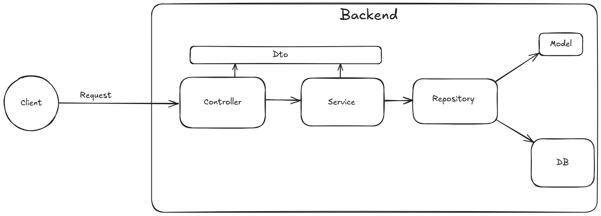

## Project Architecture

This project adopts the **Service-Controller-Repository** architecture to promote modularity, scalability, and maintainability. The application is structured into clearly defined layers with specific responsibilities, allowing for clean separation of concerns and improved testability.

### 1. Controller Layer (API Layer)

The controller layer serves as the entry point for handling client requests. It is responsible for:

* Receiving HTTP requests
* Validating request data
* Invoking corresponding service layer functions
* Returning structured HTTP responses

### 2. Service Layer (Business Logic Layer)

The service layer encapsulates all business logic and acts as an intermediary between controllers and repositories. Its responsibilities include:

* Implementing core application logic
* Enforcing business rules
* Delegating data access to the repository layer

This layer ensures controllers remain decoupled from domain logic.

### 3. Repository Layer (Data Access Layer)

The repository layer abstracts all interactions with the database. It provides:

* Structured access to persistence mechanisms
* Isolation of database operations from business logic
* Flexibility to switch databases with minimal impact on upper layers

### 4. Data Transfer Objects (DTOs)

DTOs are used to structure and validate data passed between layers. They provide:

* A consistent format for API requests and responses
* Isolation between database models and external communication

### 5. Model Layer (Database Representation)

This layer defines the database schema using Python classes. Responsibilities include:

* Mapping models to database tables
* Defining relationships, field types, and constraints
* Interfacing with the repository layer for data persistence

The model layer remains isolated from both business logic and API handling.

